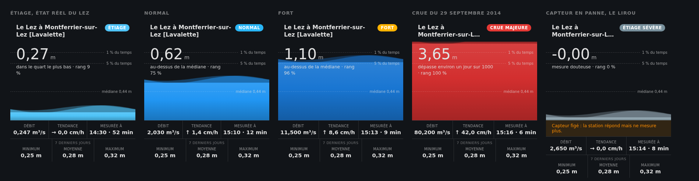
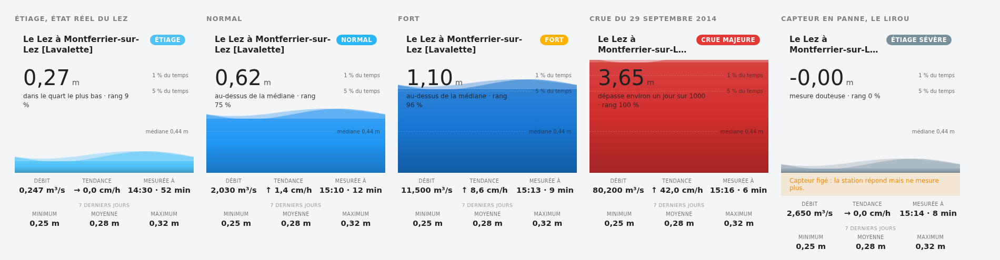

# Carte Hub'Eau

Carte Lovelace pour l'intégration `hubeau`. Aucune dépendance, aucune
compilation : un élément personnalisé et du SVG.

**Elle est livrée avec l'intégration**, dans le même paquet
(`custom_components/hubeau/frontend/hubeau-card.js`). C'est l'intégration qui
la sert et la déclare au frontend : il n'y a ni second dépôt à installer, ni
ressource à ajouter au tableau de bord. La carte apparaît dans le sélecteur
de cartes sous le nom « Hub'Eau ».

L'URL servie porte le numéro de version du paquet et n'est pas mise en cache
par Home Assistant. C'est délibéré : servis avec le `Cache-Control` de
trente et un jours appliqué par défaut aux fichiers statiques, les correctifs
de la carte restaient invisibles pendant des semaines dans le navigateur, et
plus encore dans l'application Companion.





## Le parti pris

Une rivière ne se lit pas sur une échelle linéaire. Sur le Lez, la médiane
vaut 0,44 m et le record 4,40 : en étiage, une échelle proportionnelle
écraserait l'eau en un filet invisible au bas du cadre.

L'échelle verticale suit donc les **percentiles**. Chaque repère occupe une
position fixe (médiane à 34 % de hauteur, percentile 95 à 70 %, record au
sommet) et l'eau monte selon son rang. La moitié basse du cadre couvre ainsi
la moitié du temps, ce qui rend l'étiage aussi lisible qu'une crue.

## Animations

- **le niveau** monte et descend sur 1,2 s, en transition douce ;
- **les vagues** : deux sinusoïdes, l'une glissant à contresens de l'autre.
  Rien de plus : une troisième onde puis une crête blanche ont été essayées,
  et alourdissaient le tracé sans le rendre plus vivant.

Sous la scène, un bandeau donne le **minimum, la moyenne et le maximum des
sept derniers jours**. L'intégration récupère les mesures récentes de hauteur
auprès de Hub'Eau toutes les quinze minutes, puis expose le résumé dans les
attributs du capteur. La moyenne est arithmétique sur les mesures disponibles ;
les périodes sans mesures ne sont pas inventées. Le bandeau affiche des tirets
si les données ne sont pas disponibles. Les trois valeurs ne sont pas cliquables.
Aucune lecture ni écriture dans le recorder n'est nécessaire.

La vitesse des vagues suit le débit sur une échelle logarithmique.

### Pièges rencontrés

Enfin, les vagues s'appelaient `.v`, comme les valeurs chiffrées du pied de
carte. Les nombres héritaient de l'animation de glissement et **défilaient vers
la gauche en boucle**, sans raison apparente. `outils/verifier_carte.py`
refuse désormais qu'une classe porteuse d'animation soit partagée, et vérifie
aussi qu'aucun accent grave ne s'est glissé dans le bloc de style, ce qui
romprait le littéral de gabarit qui le porte et empêcherait la carte de se
charger. Les deux se sont produits.

`prefers-reduced-motion` est respecté, et `animations: false` les coupe.

## Clic vers l'historique

La hauteur et le débit ouvrent la
fiche de l'entité, d'où l'on accède à l'historique et aux statistiques long
terme enregistrées normalement par Home Assistant depuis l'installation.

L'événement `hass-more-info` doit franchir la frontière du shadow DOM, d'où
`composed: true` : sans cela il resterait enfermé dans la carte et rien ne
s'ouvrirait.

## Configuration

```yaml
type: custom:hubeau-card
hauteur: sensor.le_lez_a_montferrier_sur_lez_lavalette_hauteur_d_eau
```

Les autres capteurs de la station se déduisent du préfixe. Ils peuvent être
nommés un à un (`debit`, `regime`, `rang`, `tendance`, `age`) pour les
installations où les identifiants auraient été renommés. `title` remplace le
titre, `animations: false` fige la scène.

## Démonstration hors Home Assistant

`outils/demo.html` affiche cinq états côte à côte (étiage, normal, fort, crue
et une station en panne) avec un `hass` simulé. Utile pour travailler le rendu
sans redémarrer quoi que ce soit :

```bash
python3 -m http.server 8777 --directory outils
```

`outils/captures.sh` refait les images de cette page et du README à partir de
cette même démonstration, dans un Chromium sans interface.

La page charge le fichier depuis `custom_components/hubeau/frontend/`, c'est
donc bien la carte livrée qui est affichée, et non une copie.
